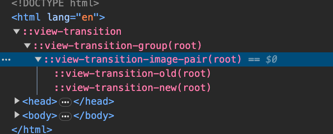
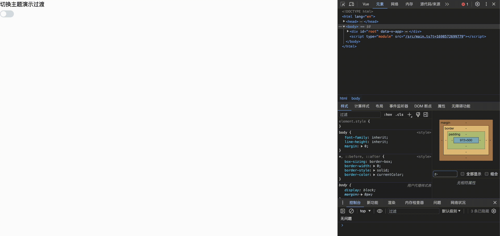

# 初衷

- 🤔️将一些比较少见但很有用的CSS记录并以demo的形式展示，以作为教程和参考的作用
- 此笔记📒作为长期更新


# ::view-transition相关

## 基础

- 参考文档：[MDN: View Transitions API](https://developer.mozilla.org/en-US/docs/Web/API/View_Transitions_API)

- 兼容性：Chrome v111+

- 作用：A视图转换为B视图的过渡


- 视图转换期间的view-transition伪类层级

```scss
::view-transition // 位于html下，唯一
└─ ::view-transition-group(root) // 可以有多个group
   └─ ::view-transition-image-pair(root)
      ├─ ::view-transition-old(root)
      └─ ::view-transition-new(root)
```




- html::view-transition：视图转换根节点

  ```scss
  // 默认样式
  html::view-transition {
    position: fixed;
    inset: 0;
  }
  ```

    - html::view-transition-group：表示单个视图转换组（设置整个组的通用样式，比如动画时间...）

      ```scss
      html::view-transition-group(*) {} // 表示作用于所有转换组的样式
      // 默认样式
      html::view-transition-group(*) {
        position: absolute;
        top: 0;
        left: 0;
      
        animation-duration: 0.25s;
        animation-fill-mode: both;
      }
      ```

      > 默认最先呈现的是old视图，如果没有old则最先呈现new视图。如果同时存在则，old试图过渡到new视图。

        - html::view-tranisition-image-pair：承载new视图、old视图的伪类容器

          ```scss
          html::view-transition-image-pair(*) {
            position: absolute;
            inset: 0;
          
            animation-duration: inherit;
            animation-fill-mode: inherit;
          }
          ```

            - html::view-transition-old：视图转换前的截图节点

              ```scss
              // 可以使用	object-fit 和 object-position 等属性操作。默认尺寸等于内容尺寸。
              // 默认样式
              @keyframes -ua-view-transition-fade-out {
                to {
                  opacity: 0;
                }
              }
              
              html::view-transition-old(*) {
                position: absolute;
                inset-block-start: 0;
                inline-size: 100%;
                block-size: auto;
              
                animation-name: -ua-view-transition-fade-out;
                animation-duration: inherit;
                animation-fill-mode: inherit;
              }
              ```

            - html::view-transition-new：视图转换后的截图节点

              ```scss
              @keyframes -ua-view-transition-fade-in {
                from {
                  opacity: 0;
                }
              }
              
              html::view-transition-new(*) {
                position: absolute;
                inset-block-start: 0;
                inline-size: 100%;
                block-size: auto;
              
                animation-name: -ua-view-transition-fade-in;
                animation-duration: inherit;
                animation-fill-mode: inherit;
              ```

- `流程`：主要表现由new、old视图截图同时开始动画 -> 删除view-transition伪类 -> 呈现html内容


## 演示:切换过程

- 下面以Vue3演示

```ts
<script setup lang="ts">
import { onMounted } from "vue";

onMounted(() => {
  setTimeout(() => {
    if (document.startViewTransition) {
      // 1. API截取当前页面的屏幕截图
      /*
         该API构建的内容
         ::view-transition
          └─ ::view-transition-group(root)
             └─ ::view-transition-image-pair(root)
                ├─ ::view-transition-old(root)
                └─ ::view-transition-new(root)
         */
      // 2. 调用回调钩子
      const transition = document.startViewTransition(() => {
        console.log("记录快照");
        const root = document.documentElement;
        root.style.setProperty("--bg", "#000000");
        root.style.setProperty("--txt", "#ffffff");
      });

      // 3. startViewTransition钩子执行完毕后，Promise执行
      transition.updateCallbackDone.then((res) => {
        console.log(res);
      });
    }
  }, 1000);
});
</script>

<template>
  <div class="view-transition">测试</div>
</template>

<style lang="scss">
:root {
  --bg: #ffffff;
  --txt: #000000;
}
body {
  background-color: var(--bg);
  color: var(--txt);
}

.view-transition {
  width: 100%;
  height: 500px;
}
html::view-transition {
}

// group编写old、new之间的公共样式(一般定义动画相关，子伪类继承这些属性即可)
html::view-transition-group(*) {
  animation-duration: 5s;
  animation-timing-function: ease;
}

// old、new内容变换的容器
html::view-transition-image-pair(*) {
  border: 5px solid red;
}

@keyframes old-animate {
  from {
    opacity: 1;
    border-color: rgba(104, 60, 241, 1);
  }
  to {
    opacity: 0;
    border-color: rgba(248, 45, 45, 0.5);
  }
}
html::view-transition-old(*) {
  width: 500px;
  animation-name: old-animate;
  border: 5px solid;
  right: 0;
}

@keyframes new-animate {
  from {
    opacity: 0;
    border-color: rgba(248, 45, 45, 0.5);
  }
  to {
    opacity: 1;
    border-color: rgba(104, 60, 241, 1);
  }
}
::view-transition-new(*) {
  width: 500px;
  animation-name: new-animate;
  border: 5px solid;
  left: 0;
}
</style>

```

- 展示：我是希望页面从白色主题转为黑色主题，但是为了让::view-transition转换过程更详细，故意展示成如下过渡


## 实战:主题切换过渡

- 思路

    - 切为黑色主题时：old视图利用`clip-path`属性对其进行切割动画过渡，new视图不进行动画（new置于最低层）
    - 切为白色主题是：new视图利用`clip-path`属性对其进行切割动画过渡，old视图不进行动画（old置于最低层）

  > 最后new截图，与最后的html样式一致

- 动图



```vue
<script setup lang="ts">
import { onMounted, ref, watch } from "vue";

// 当前主题
const isDark = ref(false);

// Switch组件的x、y坐标（避免重复计算）
const themeSwitchPos = { x: 0, y: 0 };
onMounted(() => {
  const themeSwitchEl = document.querySelector(".themeSwitch") as HTMLElement;
  const themeSwitchClient = themeSwitchEl.getBoundingClientRect();
  const x = themeSwitchClient.left + themeSwitchClient.width / 2;
  const y = themeSwitchClient.top + themeSwitchClient.height / 2;
  themeSwitchPos.x = x;
  themeSwitchPos.y = y;
});

// 监听主题色被Switch切换
watch(isDark, () => {
  if (!document.startViewTransition) {
    return;
  }

  const root = document.documentElement;

  const transition = document.startViewTransition(() => {
    if (isDark.value) {
      root.style.setProperty("--bg", "#000000");
      root.style.setProperty("--txt", "#ffffff");
    } else {
      root.style.setProperty("--bg", "#ffffff");
      root.style.setProperty("--txt", "#000000");
    }
  });
  transition.ready.then(() => {
    // 创建动画帧

    // 裁剪元素根据半径裁剪
    // 切换为黑色主题：circle(100%) -> circle(Switch组件中心位置)
    // 切换为白色主题：circle(Switch组件中心位置) -> circle(100%) 顺序要反转
    const clipPathList = [
      "circle(100%)",
      `circle(10px at ${themeSwitchPos.x}px ${themeSwitchPos.y}px)`,
    ];
    document.documentElement.animate(
      {
        clipPath: isDark.value ? clipPathList : clipPathList.reverse(),
      },
      {
        duration: 400,
        easing: "ease-out",
        pseudoElement: isDark.value
          ? "::view-transition-old(isDark)"
          : "::view-transition-new(isDark)",
      }
    );
  });
  transition.finished.then(() => {
    if (isDark.value) {
      root.classList.add("dark");
    } else {
      root.classList.remove("dark");
    }
  });
});
</script>

<template>
  <div class="view-transition2">
    <div>切换主题演示过渡</div>
    <el-switch class="themeSwitch" v-model="isDark" />
  </div>
</template>

<style lang="scss">
:root {
  --bg: #ffffff;
  --txt: #000000;
}

.view-transition2 {
  width: 100%;
  height: 500px;
  background-color: var(--bg);
  color: var(--txt);

  // 如果没有这个属性，改变默认受"root"影响
  view-transition-name: isDark; // .view-transition2 内部发生变化时，将生成名为"isDark" + "root"(默认)的伪类
}

html::view-transition-old(isDark),
html::view-transition-new(isDark) {
  animation: none;
}

// 截图旧视图做动画缩小
html::view-transition-old(isDark) {
  z-index: 2147483647; // 置于最上
}

// 截图新视图置于最后，且不做任何动画
html::view-transition-new(isDark) {
  z-index: 8;
}

// .dark类表示此时为黑色主题，所以截图z-index应该与白色主题相反
html.dark::view-transition-old(isDark) {
  z-index: 8;
}
html.dark::view-transition-new(isDark) {
  z-index: 2147483647;
}
</style>
```


## 引用

1. [使用全新的View Transitions API](https://juejin.cn/post/7207810396420325413)
2. [MDN: View Transitions API](https://developer.mozilla.org/zh-CN/docs/Web/API/View_Transitions_API)
3. [Github View Transition 代码](https://github.com/JYbill/xqv-solution/blob/main/packages/amazing-css/src/views/view-transition/ViewTransitionPage2.vue)
4. [Github：项目地址](https://github.com/JYbill/xqv-solution/tree/main/packages/amazing-css)
