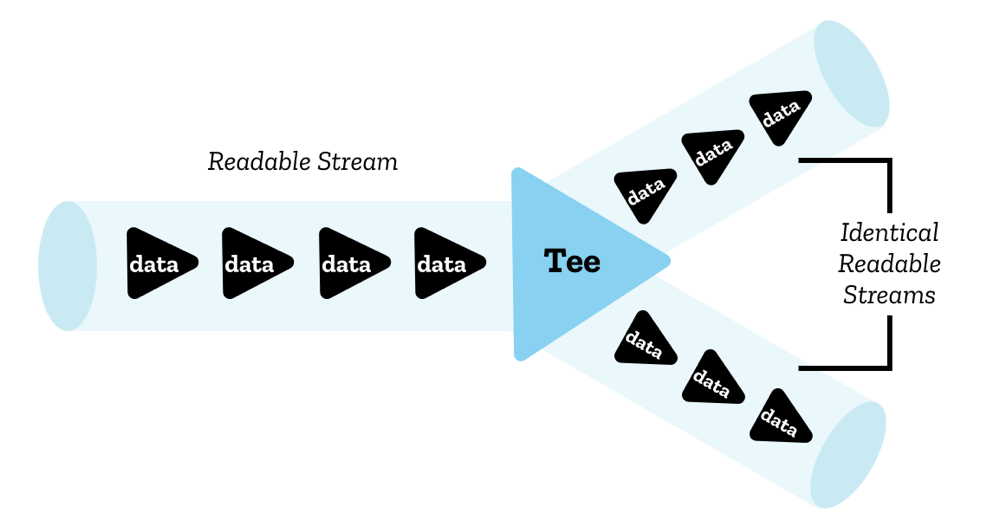
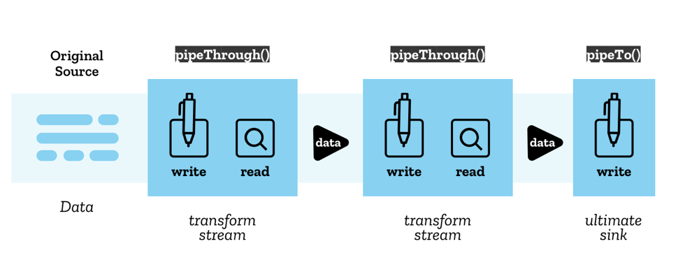

# 学习web stream和超大文件下载方案

## readableStream

- 利用fetch获取readableStream，并计算响应数据的总字节大小

```ts
const res = await fetch("https://juejin.cn/post/6844904029244358670#heading-5");
const reader = res.body.getReader();


let done = false; // 是否完成
let bufferPos = 0; // 已消费的buffer字节数
while (!done) {
  const bufferRes = await reader.read(); // 读取字节
  done = bufferRes.done; // 是否完成？
  if (!done) {
    bufferPos += bufferRes.value.length;
  }
}
console.log("总字节大小", bufferPos);
```


- 创建一个readableStream

```ts
const stream = new ReadableStream({
    start(controller) {
        // start 方法会在实例创建时立刻执行，并传入一个流控制器
        controller.desiredSize
            // 填满队列所需字节数
        controller.close()
            // 关闭当前流
        controller.enqueue(chunk)
            // 将片段传入流的队列
        controller.error(reason)
            // 对流触发一个错误
    },
    pull(controller) {
        // 将会在流的队列没有满载时重复调用，直至其达到高水位线
      	// loop执行
    },
    cancel(reason) {
        // 将会在流将被取消时调用
    }
}, queuingStrategy); // { highWaterMark: 1 }
```


- readableStream.tee() 将一个流分流成两个一模一样的流，两个流可以读取完全相同的数据
- readableStream.cancel() 关闭该可读流
- Reader.cancel() 关闭与这个reader相关联的可读流



> tips：上图来自`参考资料：网易云音乐技术团队...`

```ts
  const res = await fetch(url, { method: "GET" })
  const readableStream = res.body;
  const [readable1, readable2] = readableStream.tee();
  const reader1 = readable1.getReader();
  const reader2 = readable2.getReader();

  reader1.cancel(); // 关闭reader1流、reader2流正常使用
  console.log("reader1读取数据", await reader1.read()) // {done: true, value: undefined}
  console.log("reader2读取数据", await reader2.read()) // {done: false, value: Uint8Array(8749)}
```


- readableStream.pipeTo(writeableStream) 背压机制传入可写流（参考背压机制章节）
- readableStream.pipeThrough(TransformStream) 传入转换流将数据转换




## stream的锁机制

- 一个流只能同时有一个处于活动状态的 reader，当一个流被一个 reader 使用时，这个流就被该 reader 锁定了，此时流的 `locked` 属性为 `true`。如果这个流需要被另一个 reader 读取，那么当前处于活动状态的 reader 可以调用 `reader.releaseLock()` 方法释放锁。此外 reader 的 `closed` 属性是一个 `Promise`，当 reader 被关闭或者释放锁时，这个 `Promise` 会被 resolve，可以在这里编写关闭 reader 的处理逻辑

```ts
reader.closed.then(() => {
  console.log('reader closed');
});
reader.releaseLock();
```

> ⚠️ 当我们调用Body上的方法时，如`res.json()`，会隐式的创建reader并锁定！


## writeableStream

```ts
const stream = new WritableStream({
    start(controller) {
        // 将会在对象创建时立刻执行，并传入一个流控制器
        controller.error(reason)
            // 对流抛出一个错误
    },
    write(chunk, controller) {
        // 将会在一个新的数据片段写入时调用，可以获取到写入的片段
    },
    close(controller) {
        // 将会在流写入完成时调用
    },
    abort(reason) {
        // 将会在流强制关闭时调用，此时流会进入一个错误状态，不能再写入
    }
}, queuingStrategy); // { highWaterMark: 1 }
```


## QueuingStrategy

- 官方提供的writeableStream的queuingStrategy参数

- [MDN - ByteLengthQueuingStrategy](https://developer.mozilla.org/zh-CN/docs/Web/API/ByteLengthQueuingStrategy)： 字节长度
- [MDN - CountQueuingStrategy](https://developer.mozilla.org/zh-CN/docs/Web/API/CountQueuingStrategy)：对块计数

> 它们默认都是`{ highWaterMark: 1 }`


## 背压机制

- `背压机制`：当消费者writableStream内的数据超过`highWaterMark`水平线时，就需要暂停写入（write），否则会造成内存堆积，出现内存泄漏的问题（这块nodejs同学应该很清楚）
- Writer.ready(): Promise<void> 等待writableStream内低于水平线时即可触发，表示此时可以安全的写入数据了

```ts
  async function request() {
    const queueingStrategy = new ByteLengthQueuingStrategy({highWaterMark: 1}); // 创建水平线参数，超过1字节即触发背压
    const ws = new WritableStream({
      write(chunk, controller) {
        return new Promise((resolve) => {
          // 消费chunk
          console.log("写入字节长度", chunk.byteLength)
          setTimeout(() => {
            resolve();
          }, 500);
        })
      },
      close() {
        console.log("ws close")
      },
    }, queueingStrategy);

    const writer = ws.getWriter();
    const encoder = new TextEncoder();
    const encoded = encoder.encode("你好啊👋");
    for (const chunk of encoded) {
      writer.ready
        .then(() => {
          const buffer = new Uint8Array([chunk]);
          return writer.write(buffer);
        })
    }
  }
  request();
```

> 💡 这段代码可以直接复制在浏览器运行

- 打印内容

```ts
写入字节长度 1
// 500ms
写入字节长度 1
// 500ms
...
```

- 利用pipeTo()简化背压写法

```ts
const res = await fetch("https://picsum.photos/2000", { method: "GET" });
const body = res.body;
const queueingStrategy = new ByteLengthQueuingStrategy({highWaterMark: 1}); // 创建水平线参数，超过1字节即触发背压
const ws = new WritableStream({
  write(chunk, controller) {
    return new Promise((resolve) => {
      // 消费chunk
      console.log("写入字节长度", chunk.byteLength)
      setTimeout(() => {
        resolve();
      }, 500);
    })
  },
  close() {
    console.log("ws close")
  },
}, queueingStrategy);

body.pipeTo(ws);
```

```ts
// 打印结果
写入字节长度 114679
// 500ms
写入字节长度 81911
// 500ms
写入字节长度 49161
// 500ms
写入字节长度 65536
// 500ms
写入字节长度 36875
// 500ms
ws close
```

> 🤔 为什么一次可以写入114679字节，而不是一字节一字节写入？
>
> - 这里的highWaterMark指的是超过1字节即标识后续允许写入，但存在内存积压的风险（内存泄露）！而不是强制限制一次只能写入1字节！（这里我是以nodejs stream概念回答的）


## TransformStream

- 因为和上面的readableStream、writeableStream类似，大家完全可以参考`掘金：网易云音乐技术团队`的文章去学习


## TextEncoderStream

- TextEncoderStream: 一个转换流，既有readableStream也有writableStream

- 使用TextEncoderStream进行背压

```ts
const queueingStrategy = new ByteLengthQueuingStrategy({highWaterMark: 1}); // 创建水平线参数，超过1字节即触发背压
const ws = new WritableStream({
  write(chunk, controller) {
    return new Promise((resolve) => {
      // 消费chunk
      console.log("写入字节长度", chunk.byteLength, "Unicode", chunk.buffer)
      setTimeout(() => {
        resolve();
      }, 500);
    })
  },
  close() {
    console.log("ws close")
  },
}, queueingStrategy);
const encoderStream = new TextEncoderStream();
const writer = encoderStream.writable.getWriter();
encoderStream.readable.pipeTo(ws).then(() => { // 1
	console.log("pipeTo关闭管道");
});
for (let i = 0; i < 4; i++) {
  writer.ready.then(() => {
    return writer.write(i.toString()) // 30 31 32 33
  })
}
writer.ready.then(() => {
  writer.close();
})
```

```ts
// 输出
写入字节长度 1 Unicode ArrayBuffer(1)（二进制标识为30）
// 500ms
写入字节长度 1 Unicode ArrayBuffer(1)（二进制标识为31）
// 500ms
写入字节长度 1 Unicode ArrayBuffer(1)（二进制标识为32）
// 500ms
写入字节长度 1 Unicode ArrayBuffer(1)（二进制标识为33）
ws close
pipeTo关闭管道
```

```ts
// 代码分析
代码1：建立管道
TextEncoder Writer写入内容 -> TextEncoderStream readableStream -> 传到ws writeableStream内消费

TextEncoderStream readableStream：如果不用writer.ready钩子这里会存在内存积在此处
ws writeableStream：有pipeTo()背压机制的控制，消费者这里并不会内存积压
```


## 思考:为什么fetch/HTTP全双工流无法控制速率

1. 前后端速率的动态调节是很复杂的，特别是在应用层层面
2. 调节速率可能导致HTTP、TCP连接保持长时间占有而不用不合理
3. 在HTTP层面单位是资源，而不是TCP包


## 应用场景:超大文件(9G)下载

- 方案一：使用a标签的donwload属性配合HTTP响应头去完成（完全交给浏览器I/O能力）

```http
Content-Disposition: attachment; filename=test.mp4,
```


- 方案二：前后台配合，利用HTTP Range与steamsave.js去下载
  - HTTP Range：为了堆积数据导致浏览器崩溃（2G堆积可能就会崩溃）
  - steamsave.js 下载保存文件

```ts
// 核心代码
class OversizeFileDownloader {
  /**
   * 静态资源下载启动器
   */
  async downloadAssetsStater() {
    if (this.isDownload) {
      console.warn("downloader is running, pls wait 'isDownload = false'");
      return;
    }
    this.isDownload = true;

    this.fileTotalSize = await this.getAssetsSize(); // 静态资源总大小
    const res = await this.downloadAssetFile();
    await this.pipeToFile(res.reader, this.downloadAssetFile);
  }

  /**
   * 以静态资源环境下下载
   */
  async getAssetsSize() {
    const fileInfoRes = await fetch(this.url, {
      method: "HEAD"
    });
    const headers = fileInfoRes.headers;
    const fileSize = headers.get("Content-Length");
    return Number(fileSize);
  }

  async downloadAssetFile(startPos = 0) {
    const endPos = this.limitSize + startPos;
    const res = await fetch(this.url, {
      method: "GET",
      headers: {
        "Range": `bytes=${startPos}-${endPos}`
      }
    });
    const headers = res.headers;
    const size = Number(headers.get("Content-Length"));
    const reader = res.body.getReader();
    const result = {
      res,
      reader,
      size
    };
    return result;
  }

  /**
   * readableStream 写入 writeableStream核心处理，采用背压机制
   * @param reader readable Reader
   * @param downloadFunc 下载函数
   * @private
   */
  async pipeToFile(reader, downloadFunc) {
    const fileStream = streamSaver.createWriteStream(this.downloadFilename, {
      size: this.fileTotalSize
    });
    const writer = fileStream.getWriter();

    // 分片循环下载
    while (this.bufferPos < this.fileTotalSize) {
      let done = false; // 本次HTTP range是否写入完毕

      // 循环读取二进制并写入writeable stream
      while (!done) {
        const bufferRes = await reader.read();
        const buffer = bufferRes.value;
        done = bufferRes.done;
        if (!done) {
          await writer.ready.then(async () => {
            await writer.write(buffer);
            this.bufferPos += buffer.length;

            // 500ms间隔执行一次钩子（简单防抖）
            if (performance.now() - this.processLastTime >= 500) {
              this.processHandler.call(this);
              this.processLastTime = performance.now();
            }
          });
        }
      }

      if (this.bufferPos < this.fileTotalSize) {
        // 获取下一个range范围的二进制流
        const retryRes = await downloadFunc.call(this, this.bufferPos);
        reader = retryRes.reader;
      }
    }
    await writer.ready.then(() => {
      writer.close();
    });
    await writer.closed.then(() => {
      this.processHandler.call(this);
      console.log("✅ 下载完毕");
      this.resetState();
    });
  }
}
```

```ts
// 后台: nest.js
@Controller()
export class AppController {
  @Head('/')
  downloadOversizeFileInfo(@Res({ passthrough: true }) res: Response) {
    const filePath = "C:\\Users\\Administrator\\Downloads\\test.mp4"; // 替换成具体的视频文件
    const fileSize = fs.statSync(filePath).size;
    res.set({
      'Content-Length': fileSize,
      'Access-Control-Expose-Headers': 'Content-Length',
    });
  }

  @Get('/')
  downloadOversizeFile(
    @Req() req: Request,
    @Res({ passthrough: true }) res: Response,
  ) {
    const filePath = "C:\\Users\\Administrator\\Downloads\\test.mp4"; // 替换成具体的视频文件
    const fileSize = fs.statSync(filePath).size;
    const range = req.headers.range.split('=')[1];
    const [start, end] = range.split('-');
    const startPos = Number(start);

    if (startPos > fileSize) {
      // 越界
      throw new HttpException(
        'REQUESTED_RANGE_NOT_SATISFIABLE',
        HttpStatus.REQUESTED_RANGE_NOT_SATISFIABLE,
      );
    }

    let endPos: number;
    if (end === '') {
      // 未指定接受，默认即为总字节长度
      endPos = fileSize;
    } else if (Number(end) > fileSize) {
      // 超过文件总大小，endPos即为总字节大小
      endPos = fileSize;
    } else {
      endPos = Number(end);
    }
    console.log('debug chunk size', startPos, endPos);
    const file = createReadStream(filePath, {
      start: startPos,
      end: endPos,
    });
    res.set({
      'Content-Type': 'video/mp4',
      'Content-Length': endPos - startPos,
    });
    return new StreamableFile(file);
  }
}
```

> 代码较长，建议直接去GitHub仓库阅读源码

> github仓库地址
>
> - 前端：[https://github.com/JYbill/xqv-solution/blob/main/packages/oversize-file-download/src/assets/index.html](https://github.com/JYbill/xqv-solution/blob/main/packages/oversize-file-download/src/assets/index.html)
>
> - 后台：[https://github.com/JYbill/xqv-solution/blob/main/packages/oversize-file-download/src/app/app.controller.ts](https://github.com/JYbill/xqv-solution/blob/main/packages/oversize-file-download/src/app/app.controller.ts)


## 参考资料

- [掘金：网易云音乐技术团队 从Fetch到Streams——以流的角度处理网络请求](https://juejin.cn/post/6844904029244358670)
